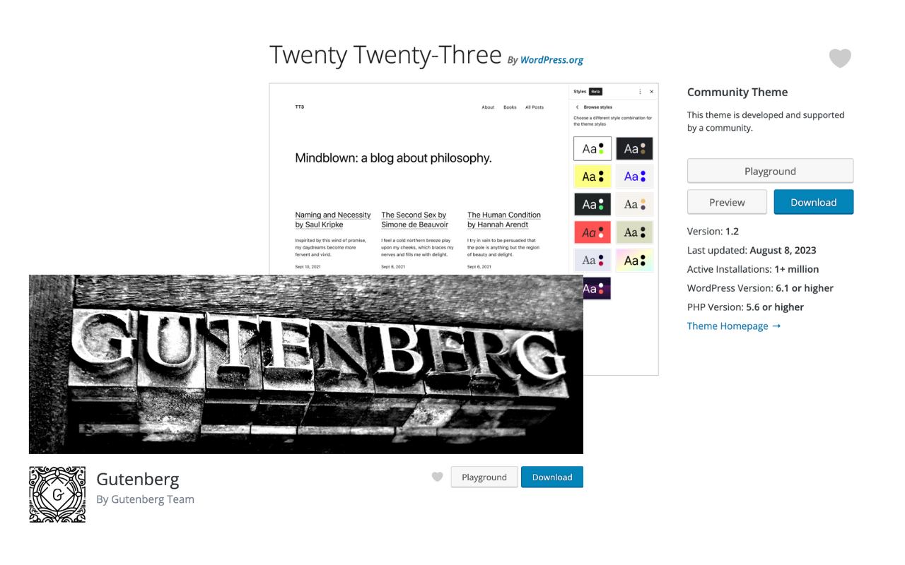

# Open In WordPress Playground (browser extention)
Browser extention to add playground button on wordpress.org plugins and themes. Playground button on page help to quickly launch plugin or theme for quick test drive.

## Install

## Usage
- Open any theme on plugin or wordpress.org
   - https://wordpress.org/plugins/   
   - https://wordpress.org/themes/   
- Find `Playground` button on page to launch the current theme or plugin in playground for quick testing

## Development 
To install the extension load the unpacked version in your Chrome browser by following these steps:
- Download or clone this repository
- Type `chrome://extensions` in the address bar
- Enable the Developer Mode switch in the top right corner
- Click the Load Unpacked Extension button
- Select the `build/chrome-mv3-dev`  directory

## Credits

[Ajit Bohra](https://twitter.com/ajitbohra)

## Meet Your Artisans 
[LUBUS](http://lubus.in) is a web design agency based in Mumbai, India.

## License

`WP Playground Browser Extention` is an open-source software licensed under the [MIT](LICENSE)